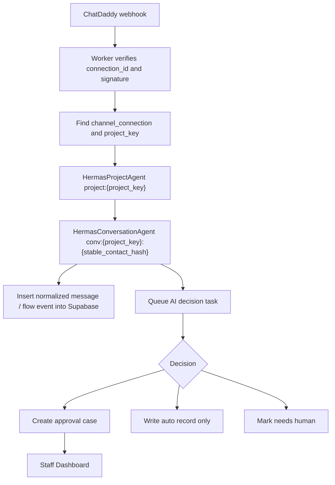

# Hermas Cloudflare Agents SDK Roadmap

Last updated: 2026-07-02

## Decision

Hermas should move from a raw Worker `fetch` AI-call pattern into Cloudflare
Agents SDK, while keeping the current approval-first operating mode.

The Tech Team direction is correct:

- Use Cloudflare Agents SDK for the agent runtime.
- Do not spin up a separate VM for v1.
- Keep Supabase/Postgres as the SaaS source of truth.
- Keep ChatDaddy as a channel adapter, not the product brain.
- Keep auto-send and auto-trigger Flow disabled until explicit gates pass.

Cloudflare Agents SDK gives Hermas durable agent identity, state, local SQL,
task queues, scheduling, WebSocket/HTTP routing, and recovery. The model brain
can still be OpenAI, Workers AI, Anthropic, Gemini, or another provider.

## Current vs Target

Current shape:

```text
ChatDaddy webhook
-> Cloudflare Worker route
-> raw JavaScript fetch / deterministic rules
-> D1/KV fallback + Dashboard cases
```

Target shape:

```text
ChatDaddy webhook
-> Cloudflare Worker route
-> Cloudflare Agent instance
-> Supabase business records
-> AI decision / approval case / auto record
-> Staff Dashboard approval
-> ChatDaddy adapter sends only after allowed action
```

The Worker remains the public API edge. The Agents SDK becomes the stateful
runtime behind the Worker.

## Agent Classes

### HermasProjectAgent

One instance per project.

Suggested instance name:

```text
project:{project_key}
```

Responsibilities:

- load project package summary
- load project readiness status
- know active channel connections
- enforce approval-first runtime config
- hold project-level hot state and daily counters
- run scheduled quality review
- coordinate project onboarding readiness
- route inbound events to the correct conversation agent

It must not store provider secrets in state or return secrets to clients.

### HermasConversationAgent

One instance per project conversation/customer.

Suggested instance name:

```text
conv:{project_key}:{stable_contact_hash}
```

Use a stable hash of provider contact/conversation ID. Do not put phone numbers
or raw customer identifiers into public Agent URLs.

Responsibilities:

- dedupe provider message IDs
- store short-lived conversation state
- separate ChatDaddy-owned Flow events from free-text customer questions
- classify risk and sales stage
- fetch relevant FAQ/package context
- draft reply text
- create `approval_cases` when staff action is required
- record `flow_events` or automatic records when no staff action is required
- write `ai_decisions`

It must not directly send WhatsApp messages in v1 approval-first mode.

### HermasOpsAgent

One instance per company or per deployment.

Suggested instance name:

```text
ops:{company_key}
```

Responsibilities:

- nightly quality review
- failed job retry summary
- cost summary
- learning note candidate generation
- onboarding readiness summary
- admin-only diagnostics

It must not appear in staff UI and must not expose backend words in staff
responses.

## Supabase vs Agent State

Use both, for different jobs.

Supabase/Postgres is the SaaS source of truth:

- companies
- projects
- users
- project memberships
- channel connections
- customers
- conversations
- messages
- approval cases
- case actions
- AI decisions
- flow events
- orders and payments
- learning notes
- audit events
- usage costs

Agent local SQL/state is hot runtime state:

- recent provider event IDs for idempotency
- current conversation stage cache
- last processed message timestamp
- queue cursor
- temporary decision context
- retry markers
- websocket/session state if later used

Rule: anything needed for reporting, staff Dashboard, compliance, learning, or
cross-project SaaS operation belongs in Supabase. Agent state can be rebuilt.

## Webhook Processing

Target flow:



Webhook response target:

- ack within 1 second
- never wait for full AI reasoning before returning 200
- dedupe duplicate provider events
- reject unknown connection IDs
- route each ChatDaddy account only to its own project

## AI Decision Contract

Agent output should be fixed JSON, not free-form hidden logic:

```json
{
  "schema_version": "hermas.agent_decision.v1",
  "project_key": "beyoute",
  "customer_id": "customer_uuid",
  "conversation_id": "conversation_uuid",
  "message_id": "message_uuid",
  "intent": "faq_question",
  "stage": "step_2",
  "risk_level": "low",
  "reply_text": "Customer-facing reply draft",
  "next_action": "create_approval_case",
  "flow_key": "step_3",
  "send_now": false,
  "trigger_flow_now": false,
  "needs_human": false,
  "reason": "Answer customer question first, then continue configured Flow after approval.",
  "source_refs": ["faq:gastro_acid", "flow:step_2"],
  "learning_candidate": null
}
```

Hard rules:

- `send_now=false` by default.
- `trigger_flow_now=false` by default.
- Button clicks and keyword Step 1 remain ChatDaddy-owned.
- Free text after Flow stops is Hermas-owned.
- Visual payment/order proof is never guessed from text only.
- Medical, refund, complaint, after-sales, policy gaps, or low-confidence
  answers go to human or approval.
- Agent must answer the actual customer question before suggesting Flow or CTA.

## Agent Tools

Allowed approval-first tools:

- `get_project_package(project_key)`
- `search_faq(project_key, query)`
- `get_recent_messages(project_key, conversation_id)`
- `normalize_chatdaddy_event(connection_id, payload_ref)`
- `create_approval_case(project_key, decision)`
- `record_auto_event(project_key, event)`
- `mark_needs_human(project_key, case_id, reason)`
- `write_ai_decision(project_key, decision)`
- `write_learning_candidate(project_key, note)`
- `get_flow_map(project_key)`
- `suggest_next_flow(project_key, stage, intent)`

Restricted tools:

- `send_message`
- `trigger_provider_flow`
- `mark_paid`
- `update_order`

Restricted tools require explicit staff/admin action, idempotency key, operator
ID from session, audit event, and project membership check.

## Onboarding Framework

Each new project should have an onboarding package before any live channel is
connected.

Required owner inputs:

1. Business and primary offer
2. Product/service mechanism
3. Customer pains and buying triggers
4. USP, proof, reviews, credentials, market comparison
5. Prices, packages, payment rules, order/COD rules
6. Safety boundaries and human handoff rules
7. FAQ document
8. Reply SOP or good human reply examples
9. Flow map with Step count and price stage
10. ChatDaddy Flow/Bot IDs for each active step
11. Order fields and payment confirmation process
12. Good and bad reply examples
13. Test cases: price, use case, objection, order, receipt, complaint, sensitive
    question, no-text attachment

System outputs:

- project package
- FAQ index
- flow map
- reply policy
- risk policy
- approval policy
- test case pack
- readiness report

Go-live gate:

- project package validated
- channel connected
- webhook payload samples mapped
- staff login and project membership checked
- staff UI boundary passes
- replay tests pass
- no secrets returned
- approval-first mode locked

## Auto Reply Roadmap

### L0: Approval-first

Current default.

- Agent drafts and classifies.
- Staff edits/approves/sends.
- No automatic customer send.
- No automatic ChatDaddy Flow trigger.

### L1: Low-risk auto record

- Flow continued, button click, status event, and no-text event are recorded.
- These do not enter staff queue.
- Still no auto customer reply.

### L2: Low-risk auto-send candidate

Only after owner/admin approval and replay score gates:

- exact FAQ match
- low-risk
- not payment/order/refund/complaint/medical
- project package has approved reply asset
- no missing fact
- duplicate-send guard passes
- rollback path exists

### L3: Controlled reply-plus-flow

Only after L2 is stable:

- before price stage: answer question, then continue configured Flow
- after price stage: answer, confidence/CTA, no blind Flow
- ChatDaddy button Flow remains ChatDaddy-owned
- Hermas never guesses the next Flow from a vague message

### L4: Autonomous takeover

Separate future cutover. Not part of current v1.

## What The Owner Needs To Provide

Do not paste secrets into chat. Put secrets into Cloudflare/Supabase/Vercel env
or give controlled account access.

### Cloudflare

- Cloudflare account access for the deployment owner
- Worker project access
- permission to add Durable Object bindings and migrations
- production and staging Worker names/routes
- environment secret values:
  - `OPENAI_API_KEY` if OpenAI remains the model provider
  - `SUPABASE_URL`
  - `SUPABASE_SERVICE_ROLE_KEY`
  - provider-specific channel secrets
- observability/log destination

### Supabase

- production and staging projects
- project refs
- `SUPABASE_URL`
- `SUPABASE_ANON_KEY`
- `SUPABASE_SERVICE_ROLE_KEY`
- pooled connection string
- direct connection string
- private buckets: `chat-attachments`, `project-assets`, `faq-uploads`
- first admin email
- staff email list and project assignments

### ChatDaddy Per Brand

- account ID
- API key
- webhook secret
- Flow/Bot IDs
- Step map and price stage
- rate limit information
- real payload samples:
  - inbound text
  - button click
  - image/receipt
  - audio
  - outbound by ChatDaddy
  - Flow continued
  - paid/COD event
  - failed message
  - contact update

### Business Content Per Brand

- FAQ
- Reply SOP
- prices/packages
- promo/offer rules
- proof/review assets
- risk and handoff rules
- order/payment rules
- good human replies
- bad replies to avoid
- test case examples

## Implementation Phases

### Phase 0: Contract and docs

- Add this roadmap.
- Add transition contract.
- Keep current Worker live and safe.

### Phase 1: Agent runtime scaffold

- Added first runnable scaffold:
  - `chatdaddy_platform/worker/package.json`
  - `chatdaddy_platform/worker/src/hermas-agents-worker.js`
  - `chatdaddy_platform/worker/wrangler.agents.example.toml`
  - `CHECK_Hermas_Cloudflare_Agents_Runtime.command`
- The scaffold exports:
  - `HermasProjectAgent`
  - `HermasConversationAgent`
  - `HermasOpsAgent`
- The scaffold has Durable Object bindings, `new_sqlite_classes`, `nodejs_compat`,
  local SQL state, ChatDaddy webhook routing, decision-test endpoint, and optional
  Supabase persistence.
- Existing production `worker-v2.js` remains the live fallback until the owner
  and Tech Team decide to cut over.
- Keep existing `/api/hermas/...` endpoints.

Run locally after installing dependencies:

```bash
cd chatdaddy_platform/worker
npm install
npm run dev:agents
```

Then test:

```bash
curl -s http://127.0.0.1:8787/api/agents/runtime/health
curl -s -X POST http://127.0.0.1:8787/api/agents/runtime/decide-test \
  -H 'content-type: application/json' \
  -d '{"text":"等下付款","contact":{"name":"Test Customer","id":"demo_contact"}}'
```

### Phase 2: Webhook route through agents

- Keep existing ChatDaddy webhook URL stable if possible.
- Resolve `connection_id`.
- Route to `HermasProjectAgent`.
- Queue per-conversation processing.
- Write normalized events to Supabase.
- Return 200 quickly.

### Phase 3: Decision engine inside ConversationAgent

- Load project package and recent messages.
- Use the AI decision contract.
- Create approval cases or auto records.
- Store decisions and usage.
- Keep sends blocked by approval-first guard.

### Phase 4: Dashboard session and project permissions

- Email/password login.
- HttpOnly session cookie.
- Project switcher.
- Staff only sees assigned projects.
- Staff writes use session `operator_id`.

### Phase 5: Onboarding productization

- Admin project creation wizard.
- Upload FAQ/SOP/assets.
- Flow map form.
- Payload sample verification.
- Readiness gate before staff handoff.

### Phase 6: Optional controlled automation

- L1/L2/L3 only after replay score, staff review, owner signoff, and rollback.
- Default remains approval-first for every copied project.

## First Engineering Ticket

Create a branch named:

```text
feature/hermas-cloudflare-agents-runtime
```

Add:

```text
chatdaddy_platform/worker/package.json
chatdaddy_platform/worker/src/index.ts
chatdaddy_platform/worker/src/agents/HermasProjectAgent.ts
chatdaddy_platform/worker/src/agents/HermasConversationAgent.ts
chatdaddy_platform/worker/src/agents/HermasOpsAgent.ts
chatdaddy_platform/worker/src/hermas/decision-contract.ts
chatdaddy_platform/worker/src/hermas/tools.ts
chatdaddy_platform/worker/wrangler.toml updates
```

Acceptance:

- `npm i agents` is present.
- Agent classes are exported.
- Wrangler has Durable Object bindings and SQLite migrations.
- Existing approval-first checks still pass.
- Staff boundary check still passes.
- Webhook test creates no customer send unless staff action calls send.

## Official References

- Cloudflare Agents overview: https://developers.cloudflare.com/agents/
- Add Agents SDK to existing project: https://developers.cloudflare.com/agents/getting-started/add-to-existing-project/
- Agents API: https://developers.cloudflare.com/agents/runtime/agents-api/
- Webhooks with Agents: https://developers.cloudflare.com/agents/communication-channels/webhooks/
- Calling LLMs from Agents: https://developers.cloudflare.com/agents/concepts/calling-llms/
- Agents configuration: https://developers.cloudflare.com/agents/runtime/operations/configuration/
