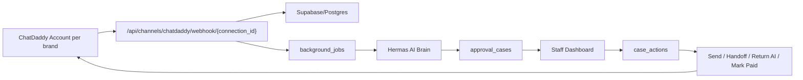

# Hermas SaaS v1 Scale Implementation

Last updated: 2026-07-02

## Goal

Support the first 20 brands with about 2,000 total inbound messages per day while staying approval-first by default. Customer service should only need the Dashboard. GitHub stores code, Vercel/Cloudflare run stateless APIs, and Supabase/Postgres becomes the SaaS source of truth.

## Current Decision

- Keep `approval-first`.
- Keep `auto_send_enabled=false`.
- Keep `auto_trigger_flows_enabled=false`.
- Use Supabase/Postgres for durable business data.
- Use Cloudflare Agents SDK as the next stateful agent runtime layer; see `hermas_ai/docs/HERMAS_CLOUDFLARE_AGENTS_SDK_ROADMAP.md`.
- Use background jobs for AI decisions, name enrichment, Flow sync, review, and retries.
- Keep staff UI free of backend words, tokens, webhooks, D1, KV, raw payload, and secrets.

## Architecture



Webhook handlers should acknowledge quickly. Do not wait for contact enrichment, ChatDaddy sync, or AI review before returning a 200.

## Implemented In This Repo

- Supabase migration: `hermas_ai/migrations/0003_supabase_saas_scale.sql`
- Beyoute dev seed: `hermas_ai/migrations/0004_supabase_beyoute_dev_seed.sql`
  - creates non-secret CTG/Beyoute project rows
  - creates a non-secret `beyoute-chatdaddy` channel connection placeholder
  - adds idempotency indexes for channel connections, conversations, and approval cases
- Public staff API aliases:
  - `GET /api/projects/{project_key}/queue`
  - `GET /api/projects/{project_key}/cases/{case_id}`
  - `POST /api/projects/{project_key}/cases/{case_id}/send`
  - `POST /api/projects/{project_key}/cases/{case_id}/return-ai`
  - `POST /api/projects/{project_key}/cases/{case_id}/handoff`
  - `POST /api/projects/{project_key}/cases/{case_id}/manual-reply`
  - `POST /api/projects/{project_key}/cases/{case_id}/mark-paid`
- Admin API aliases:
  - `GET /api/admin/projects`
  - `POST /api/admin/projects`
  - `PATCH /api/admin/projects/{project_key}`
  - `GET /api/admin/projects/{project_key}/readiness`
- ChatDaddy per-connection webhook:
  - `POST /api/channels/chatdaddy/webhook/{connection_id}`

Existing `/api/hermas/...` endpoints remain the business layer.

## Supabase Tables

The v1 migration creates or extends:

- `companies`
- `projects`
- `users`
- `user_sessions`
- `project_memberships`
- `channel_connections`
- `customers`
- `conversations`
- `messages`
- `approval_cases`
- `case_actions`
- `ai_decisions`
- `flow_events`
- `orders`
- `payments`
- `learning_notes`
- `audit_events`
- `usage_costs`
- `background_jobs`

Every business table is keyed by `project_key`. Important indexes include:

- `project_key + status + updated_at`
- `project_key + customer_id`
- `project_key + conversation_id`
- `project_key + message_at`

## Staff Dashboard Rules

The staff first screen should fetch only queue summary and the first page of cases. Full chat, attachments, AI decision detail, action history, and review context load only after a case is opened.

Staff queue includes only cases requiring action:

- pending approval
- needs human
- order/payment review
- returned AI needing review

Staff queue must not mix in:

- external Flow already continued
- button click handled by ChatDaddy
- empty/non-text event
- status/read/delivered event
- auto-record only event

Those belong in automatic records.

## ChatDaddy Payload Samples Needed

The Tech Team should provide real JSON samples from ChatDaddy. Mask phone numbers, names, tokens, and message content if needed, but do not remove fields or change nesting.

Required samples:

- inbound text
- button click / quick reply
- image or receipt attachment
- audio or voice note
- outbound message sent by ChatDaddy
- external Flow continued
- paid or COD event
- failed message
- contact update

Why this matters: Hermas must know which field contains customer text, customer name, button value, provider message ID, chat/thread ID, contact ID, attachment URL, account ID, and Flow status. Without real payload shape, the adapter cannot safely separate ChatDaddy-owned Flow events from human questions after Flow stops.

## Secrets And Env Vars To Provide

Supabase:

- `SUPABASE_URL`
- `SUPABASE_ANON_KEY`
- `SUPABASE_SERVICE_ROLE_KEY`
- pooled connection string
- direct connection string
- staging project ref
- production project ref

Auth:

- first admin email
- staff email list
- production redirect URL
- staging redirect URL

Storage:

- private bucket `chat-attachments`
- private bucket `project-assets`
- private bucket `faq-uploads`

ChatDaddy for each of 20 accounts:

- account ID
- API key
- webhook secret
- Flow/Bot IDs
- rate limit information

Ops:

- production domain
- staging domain
- backup/PITR plan
- log platform
- alert destination

Never put these values into GitHub, public frontend, project packages, or staff UI.

## Release Gates

Run before staff rollout:

```bash
./CHECK_Hermas_SaaS_Scale_20_Brands.command
./CHECK_Dashboard_Customer_Service_UX.command
./CHECK_Hermas_Staff_Dashboard_Boundary.command
./CHECK_Hermas_Project_Readiness.command
```

Acceptance targets for the first 20 brands:

- Queue p95 below 2 seconds.
- Case detail p95 below 2 seconds.
- Webhook ack below 1 second.
- Staff can switch assigned projects.
- Staff cannot read another project queue/case/message.
- Dashboard first page does not wait for name enrichment or ChatDaddy sync.
- Edited reply sends only after confirmation.
- `确认已付款` requires amount and sends no customer message.
- Failed jobs retry and then move to dead-letter.

## Rollout Order

1. Create staging Supabase project.
2. Apply base schema, then `0003_supabase_saas_scale.sql`.
3. For the Beyoute dev pilot, apply `0004_supabase_beyoute_dev_seed.sql`.
4. Create first admin and staff users.
5. Seed the remaining 19 `projects` and `channel_connections`.
6. Connect one ChatDaddy account in staging and collect payload samples.
7. Verify adapter normalization for text, button, image, audio, Flow, payment, failed message.
8. Run Dashboard staff boundary checks.
9. Load test 20 projects at 2,000 inbound/day equivalent.
10. Repeat on production.
11. Give staff the production login URL only. Do not give tokens or backend endpoints.
